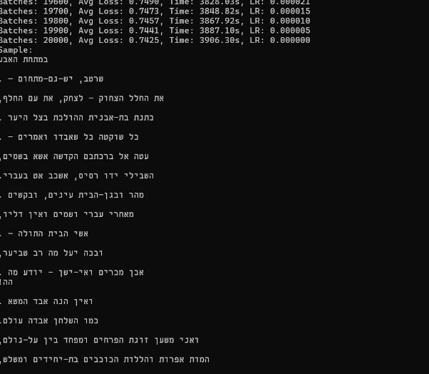

# Transformer-Based Language Model

This repository contains the implementation of a transformer-based language model (decoder-only transformer) in PyTorch. The model is designed to predict the next character in a sequence, using a character-level language model trained on small datasets. This project includes the implementation of self-attention, multi-head attention, and transformer decoder blocks, without using pre-made transformer layers.

## Model Overview

### Architecture
The transformer model implemented here is a character-level language model using a causal self-attention mechanism. The model was trained with different configurations of layers, attention heads, and MLP hidden sizes. Each configuration was evaluated based on its ability to minimize loss and generate coherent outputs.

### Key Components:
- **Self-attention and Causal Attention**: Custom implementation of self-attention that computes attention scores, applies causal masking, and ensures tokens only attend to previous tokens in a sequence.
- **Multi-head Attention**: Multiple self-attention heads are used to capture different aspects of the input sequences.
- **Residual Connections**: Implemented in transformer blocks to ensure stable gradient propagation and improve training.
- **Embedding Layer**: Combines vocabulary and positional embeddings for input sequences.
- **Training Optimizations**: Different configurations of the model were explored to minimize overfitting and improve generalization.

### Model Configurations

1. **L6_H12_E192_M768**: 6 layers, 12 heads, embedding size 192, MLP size 768
2. **L12_H6_E192_M768**: 12 layers, 6 heads, embedding size 192, MLP size 768
3. **L6_H6_E192_M1536**: 6 layers, 6 heads, embedding size 192, MLP size 1536
4. **L8_H8_E192_M1536**: 8 layers, 8 heads, embedding size 192, MLP size 1536

The best-performing model was **L12_H6_E192_M768**, achieving a loss of ~0.32 by the end of training.

---

## Training Observations

### Loss History:

This graph shows the loss history for different model configurations over 30,000 training batches. The final losses range between 0.3 and 0.7. While the original model achieved a loss of 0.3 after 50k batches, it was observed that the model overfitted.

1. **Best Model Configuration:** 
   - **L12_H6_E192_M768** configuration (orange line) achieved the lowest loss, reaching about 0.32 by the end of training.

2. **Observations:**
   - All models show a rapid decrease in loss during the first 5,000 batches.
   - The 12-layer model (orange line) consistently outperforms others after about 7,500 batches.
   - Increasing the number of layers (12 vs. 6) shows more benefit than increasing the number of heads or MLP size.

3. **Conclusions:**
   - **More layers (12)** with fewer heads (6) seem optimal for this task.
   - A larger MLP size (1536) helps when fewer layers are used.
   - Training for at least 15,000-20,000 batches is necessary to see the full potential of different configurations.

---

## Model Performance and Training Details:

**Training Details:**
- **Training sequences:** 128
- **Batch size:** 64

1. **Impact of Layers vs. Heads vs. MLP Dimensions:**
   - **Number of Layers (4 vs 8):**
     - 4 layers: Loss 2.1178, English Score 73.52
     - 8 layers: Loss 2.0336, English Score 74.37
   - **Number of Heads (4 vs 8):**
     - 4 heads: Loss 2.1178, English Score 73.52
     - 8 heads: Loss 2.1492, English Score 75.19
   - **MLP Hidden Size Factor (2 vs 4 vs 6):**
     - Factor 2: Loss 2.1729, English Score 70.29
     - Factor 4: Loss 2.1178, English Score 73.52
     - Factor 6: Loss 2.0967, English Score 76.64

**Summary:**
- MLP dimensions (hidden size factor) have the most significant impact on performance.
- Increasing the number of layers shows clear benefits, while increasing heads has a less pronounced impact.

---

## Best Model: Detailed Generation and Attention Analysis

### Example Outputs from the Best Model (**L12_H6_E192_M768**):

- **Prompt:** 'Friends, Romans, countrymen,'  
  **Generated:** 'and rack With the princess three of those severest days, Can curse their curses that under fear their heads? NORTHUMBERLAND: No doubt, no doubt; and'

- **Prompt:** 'O Romeo, Romeo! wherefore art thou'  
  **Generated:** 'Romeo? Deny thy father and had not a mind; For one being but a sudden, like a port Having so long as is so big as a feast, To be revenged on him that'

- **Prompt:** 'Double, double toil and trouble;'  
  **Generated:** 'You are no warrant, sir. LUCIO: I warrant you. ISABELLA: O, with such gifts No hope but for my disposition. DUKE VINCENTIO: Love the truth, no mor'

These examples show that the model can generate coherent English text with a clear understanding of character transitions and sentence structure.

### Attention Patterns:

The model exhibits distinct attention behaviors, including attention to diagonal tokens (focusing on themselves), previous tokens, and specific patterns like spaces and punctuation.

Top 5 head/layer combinations for different attention behaviors:
- **Diagonal (self-attention):** Layer 0, Head 4: 0.4164
- **Previous Token Attention:** Layer 0, Head 5: 0.9999
- **First Token Attention:** Layer 5, Head 3: 0.9077
- **Spaces:** Layer 10, Head 4: 0.0947
- **Vowels:** Layer 9, Head 5: 0.0481
- **Punctuation:** Layer 2, Head 2: 0.1650

---

## Visuals:

The above visuals show interesting patterns in the model's attention mechanism, such as focusing on specific characters or sentence structures, revealing how the model captures context.

---

## Additional Observations:

- **Optimizer Choice:** Models using Adam or AdamW consistently outperform those using SGD.
- **Embedding Size Impact:** Increasing the embedding size to 192 improves performance.
- **Batch Size and Training Time:** Larger batch sizes help with generalization but require more time to train.

### Example of Overfitting:

The original model, after 50k batches, achieved a very low loss (~0.3), but it exhibited overfitting, generating repetitive or incoherent text.

---

## Hebrew Data Performance:

The model also trained on Hebrew data and achieved a loss of 0.74. It trained faster compared to the English data, potentially due to shorter word lengths in Hebrew.

---
